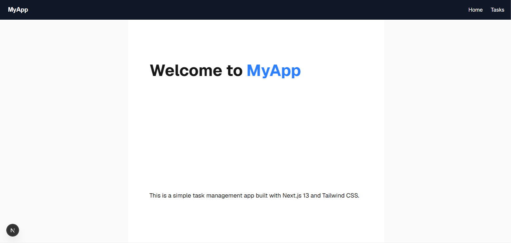
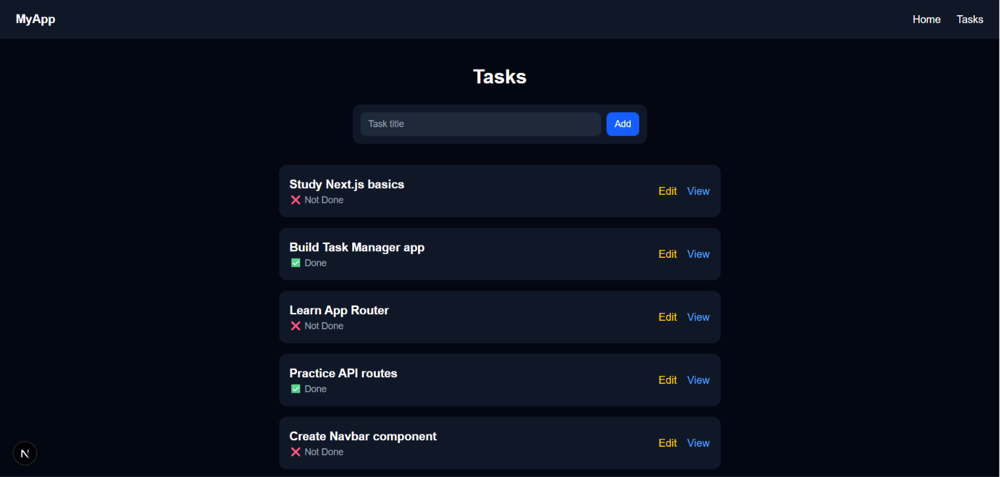
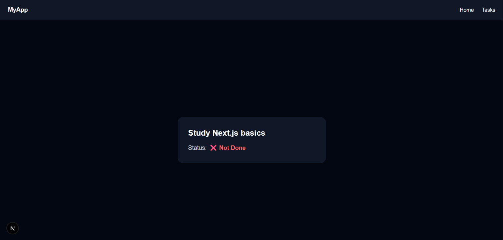
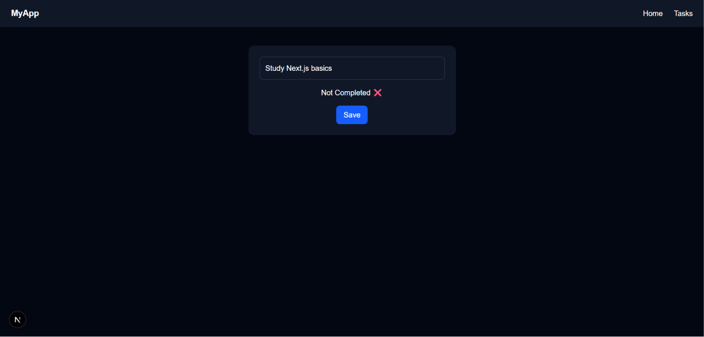
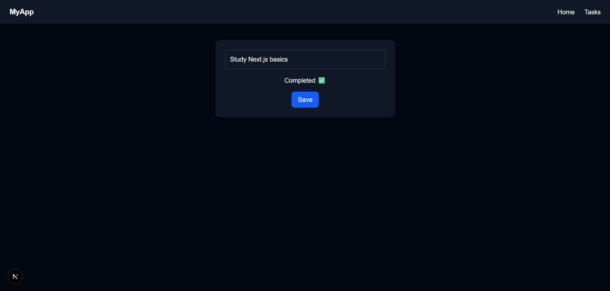

# Task Manager App

A full-stack **Task Manager** application built with **Next.js App Router**. This project was created to practice the core features of Next.js, including file-based routing, Server Components, Client Components, dynamic routing, API Route Handlers, and data fetching.

The application allows users to browse tasks, view task details, add new tasks, and update the name and completion status of existing tasks.

---

## Preview
### Home Page



### Tasks Page




### Tasks Page




### Edit Task Page





---

## Features

* Home page with navigation
* Display all tasks
* View task details
* Add new tasks
* Edit task completion status
* Dynamic routes
* API Route Handlers
* Loading UI
* Reusable React components

---

## Tech Stack

* Next.js
* React
* JavaScript (ES6)
* App Router
* Server Components
* Client Components
* Route Handlers
* Fetch API
* CSS

---

## Project Structure

```text
src/
│
├── app/
│   ├── layout.js
│   ├── page.js
│   │
│   ├── tasks/
│   │   ├── page.js
│   │   ├── loading.js
│   │   └── [id]/
│   │       ├── page.js
│   │       └── edit/
│   │           └── page.js
│   │
│   └── api/
│       └── tasks/
│           ├── get/
│           │   ├── route.js
│           │   └── [id]/
│           │       └── route.js
│           │
│           └── post/
│               └── route.js
│
├── components/
│   ├── Navbar.js
│   ├── TasksList.js
│   ├── AddTaskForm.js
│   └── EditTaskForm.js
│
└── lib/
    └── data.json
```

---

## Application Routes

| Route                 | Description           |
| --------------------- | --------------------- |
| `/`                   | Home page             |
| `/tasks`              | Display all tasks     |
| `/tasks/[id]`         | Display a single task |
| `/tasks/[id]/edit`    | Edit a task           |
| `/api/tasks/get`      | Get all tasks         |
| `/api/tasks/get/[id]` | Get a single task     |
| `/api/tasks/post`     | Create a new task     |
| `/api/tasks/[id]`     | Update task status    |

---

# Next.js Concepts Used

## App Router

The application uses the **App Router**, where routes are automatically created based on the folder structure inside the `app` directory.

Examples:

| File                          | Route             |
| ----------------------------- | ----------------- |
| `app/page.js`                 | `/`               |
| `app/tasks/page.js`           | `/tasks`          |
| `app/tasks/[id]/page.js`      | `/tasks/:id`      |
| `app/tasks/[id]/edit/page.js` | `/tasks/:id/edit` |

Dynamic routing is implemented using the `[id]` folder.

---

## Root Layout

The application uses a shared root layout (`layout.js`) that wraps every page.

The layout contains:

* Global page structure
* Navigation bar
* Shared layout across the application

---

## Server Components

Most pages are built as **Server Components**, allowing data to be fetched on the server before rendering.

Used in:

* Home page
* Tasks page
* Task details page

Benefits:

* Faster initial rendering
* Reduced client-side JavaScript
* Better performance

---

## Client Components

Interactive components use:

```javascript
"use client";
```

Client Components:

* AddTaskForm
* EditTaskForm

Responsibilities:

* Handle user input
* Submit forms
* Send requests to API Routes
* Update the interface after user actions

---

## Dynamic Routes

Dynamic routing is implemented using:

```text
app/tasks/[id]
```

This allows pages such as:

```text
/tasks/1
/tasks/2
/tasks/3
```

Each page displays information for a different task.

---

## Loading UI

The project includes:

```text
app/tasks/loading.js
```

Next.js automatically displays this component while the Tasks page is loading.

---

# API Routes

The application uses **Next.js Route Handlers** to create API endpoints.

---

## GET All Tasks

Endpoint:

```text
GET /api/tasks/get
```

Returns all available tasks.

Example response:

```json
[
  {
    "id": 1,
    "title": "Learn Next.js",
    "done": false
  }
]
```

---

## GET Single Task

Endpoint:

```text
GET /api/tasks/get/[id]
```

Returns one task based on the dynamic ID.

Example:

```text
/api/tasks/get/1
```

---

## POST Create Task

Endpoint:

```text
POST /api/tasks/post
```

Creates a new task.

Request Body:

```json
{
  "title": "Finish Portfolio Project"
}
```

---

## PATCH Update Task

Endpoint:

```text
PATCH /api/tasks/[id]
```

Updates the selected task status.

Example:

Before:

```json
{
  "id": 1,
  "title": "Learn Next.js",
  "done": false
}
```

After:

```json
{
  "id": 1,
  "title": "Learn Next.js",
  "done": true
}
```

---

# Components

## Navbar

A reusable navigation component used throughout the application.

Links:

* Home
* Tasks

---

## TasksList

Displays the list of available tasks.

---

## AddTaskForm

A Client Component responsible for:

* Reading user input
* Creating new tasks
* Sending POST requests to the API

---

## EditTaskForm

A Client Component responsible for:

* Editing task information
* Sending update requests
* Updating task status

---

# Data Source

The application uses:

```text
src/lib/data.json
```

as a simple mock data source instead of a database.

Tasks are loaded from this file and used by the API routes.

Since this project does not use a database, changes made while the application is running are **not permanently saved** to `data.json`.

---

# Data Flow

```text
User
   │
   ▼
Client Components
(AddTaskForm / EditTaskForm)
   │
   ▼
API Routes
(/api/tasks)
   │
   ▼
Mock Data
(data.json)
   │
   ▼
Server Components
   │
   ▼
Rendered UI
```

---

# Getting Started

Clone the repository:

```bash
git clone https://github.com/your-username/task-manager.git
```

Navigate into the project:

```bash
cd task-manager
```

Install dependencies:

```bash
npm install
```

Run the development server:

```bash
npm run dev
```

Open:

```text
http://localhost:3000
```

---

# Future Improvements

* Connect the application to a real database
* Add authentication
* Delete tasks
* Search tasks
* Filter completed and pending tasks
* Improve UI/UX
* Deploy the application using Vercel

---

# What I Learned

Building this project helped me practice:

* Next.js App Router
* File-based routing
* Dynamic routes
* Server Components
* Client Components
* API Route Handlers
* Fetch API
* Component-based architecture
* Organizing scalable Next.js projects

---

## License

This project was built for learning purposes and as part of my personal portfolio.


